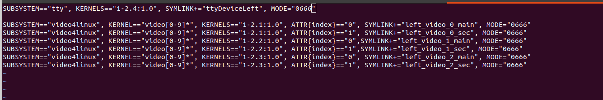
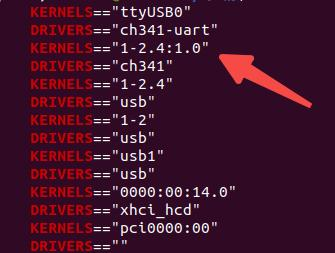
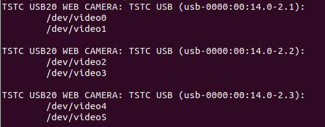
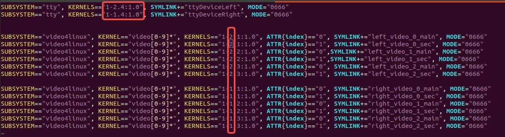

# genrobot_controller_sdk_cpp
## 环境部署
```
USB接口需3.0
```

## 配置USB接口

### 单爪USB口配置
最终配置形式如图,配置完后该USB口可以识别任意Gen Controller，后续无需再次配置，该文件模板存放在
```
config/99-usb-serial.rules
```
  

用户需修改地方为:  
  

参数1处修改方法如下，
执行：

```
cd /dev && ls | grep ttyUSB
udevadm info -a -n /dev/ttyUSB* | grep -E "KERNELS|DRIVERS"
```

将输出中的第二个KERNELS数值配置到1处:  


参数2处修改方法如下，执行：
```
v4l2-ctl --list-devices
```
输出  


然后针对该USB的第一个相机执行：
```
udevadm info -a -n /dev/video* | grep -E "KERNELS|SUBSYSTEMS"
```
将输出的第一个KERNELS数值配置为到2处  
  
然后将模板文件copy至下列地址处
```
sudo cp config/99-usb-serial.rules /etc/udev/rules.d/
```
然后加载配置
```
sudo udevadm control --reload-rules
sudo udevadm trigger
```

### 双爪USB口配置
最终配置形式如图所示  


需修改地方  


首先插入左夹爪，按照单夹爪的配置方法进行配置；然后拔下左夹爪，插入右夹爪，再次按照单夹爪的配置方法进行配置；最后加载配置。

### 多爪USB口配置
再次同样添加配置到99-usb-serial.rules中。

## SDK运行
直接执行 `start_gripper.cpp` 脚本（每次运行会按需编译，修改脚本内容后再次执行即可生效）。

### 单爪启动demo

```
cd gen_con_sdk_cplus_release

mkdir -p build && cd build #如果存在build文件夹则删除

cmake ..

make

cd ..

./start_gripper.cpp left   # 当前配置夹爪固定打开5cm

./start_gripper.cpp left --distance 0.08  # 夹爪固定打开8cm，输入距离区间为[0.0, 0.103],即最大可开10cm

./start_gripper.cpp left --sine-wave  # 夹爪持续开合10s

./start_gripper.cpp left --print-tactile-info  #触觉数据读取

```

启动后会弹出三个图像窗口:
```
/camera_0   # 中间相机
/camera_1   # 左侧相机
/camera_2   # 右侧相机

```
打印数据有：
```
tactile数据
gripper distance数据
```

### 双爪启动demo
```
cd gen_con_sdk_cplus_release
启动
./start_gripper.cpp left
另一终端启动
./start_gripper.cpp right
```

启动后会弹出六个图像窗口

## 程序使用方法
### 传感器数据读取
使用以下回调函数分别进行获取
```

capture_frames_callback  //摄像头帧采集回调函数
tactile_callback         //触觉数据回调函数
encoder_callback         //夹爪开合度数据回调函数
```

### 夹爪开合控制指令下发
使用以下指令
```
if (databus_) {
        databus_->setTargetDistance(distance);
```

## 设备相关参数获取 （不要启动其它控制程序）

### 直接运行脚本
```
./camera_cmd.sh [left|right]  <command>
```

```

**参数说明：**

| 参数       | 说明                                |
|----------- |------------------------------------|
| `camerarc`| 中间相机标定（生成 `cam0_sensor.yaml`）|
| `camerarl`| 左侧相机标定（生成 `cam1_sensor.yaml`）|
| `camerarr`| 右侧相机标定（生成 `cam2_sensor.yaml`）|
| `MCUID`   | 查询设备 MCUID                         |

**标定生成的 YAML 文件** 会保存到 `gen_controller_sdk_cpp/calib_result` 目录下。
```
### **示例：**


### 单夹爪
#### 获取相机标定文件
```
中间相机
./camera_cmd.sh camerarc
左边相机
./camera_cmd.sh camerarl
右边相机
./camera_cmd.sh camerarr
```
#### 查询设备 ID
```
./camera_cmd.sh MCUID
```
### 双夹爪
#### 获取相机标定文件
```
中间相机
./camera_cmd.sh left camerarc
./camera_cmd.sh right camerarc
左边相机
./camera_cmd.sh left camerarl
./camera_cmd.sh right camerarl
右边相机
./camera_cmd.sh left camerarr 
./camera_cmd.sh right camerarr
```

#### 查询设备 ID
```
./camera_cmd.sh left MCUID
./camera_cmd.sh right MCUID
```
